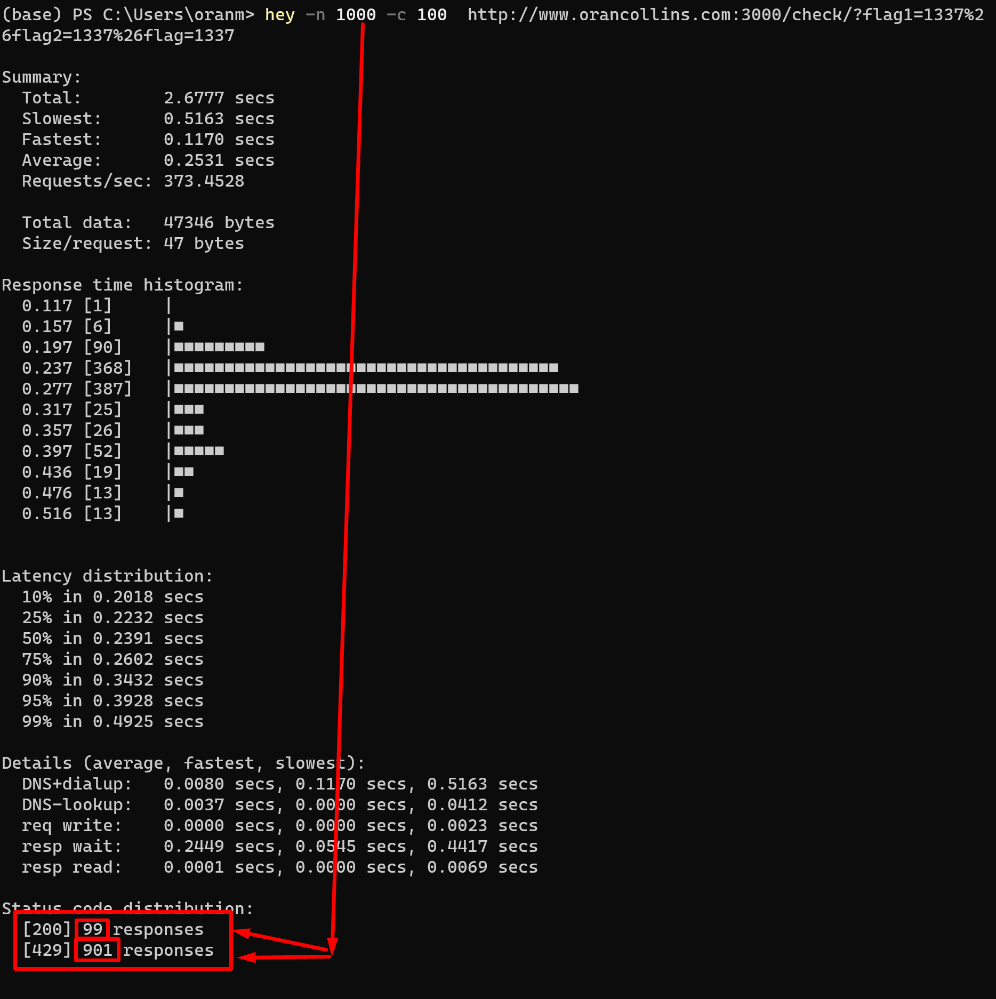

# business_card_puzzle
 simple website that checks the solution to my business card puzzle


# change directory:
```bash
cd frontend
```

# install dependencies:
```bash
npm install
```
# run the app:
(linux)
```bash
SET DEBUG=frontend:* & npm start
```
(windows Powershell)
```bash
$env:DEBUG='frontend:*'; npm start
```

# how to run tests
```bash
npm run test
```

# docker 
### build locally
```bash
docker build -t wisehackermonkey/businesscardpuzzle .
docker login
docker push wisehackermonkey/businesscardpuzzle:latest
```

### build locally (docker-compose)
```bash
cd /path/to/project/dir/
docker-compose -f docker-compose.local.yml build
docker-compose -f docker-compose.local.yml up
```

# docker publish
### Docker push image docker hub
```bash
docker login
docker push wisehackermonkey/businesscardpuzzle:latest
```

## setup
#### create a file called .env 
##### with the contents Similar to this NOTE: flags must be unique
> touch .env 
```text
FLAG1=1234567890
FLAG2=0987654321
FLAG3=1111111111
PORT=3000
``` 
## run 
```bash
docker-compose --env-file .\.env build

docker-compose  up
OR 
docker-compose --env-file .\.env up
```
## deploy (docker-compose)
```bash
git clone https://github.com/wisehackermonkey/business_card_puzzle.git
cd business_card_puzzle/
touch .env
# MODIFY THE FLAG values to match your desired values
echo "FLAG1=123456789
FLAG2=999999999
FLAG3=111111111
PORT=3000">>.env
```
# OPTIONS

### 1) use the envirmental variable file you just created
```bash
docker-compose -f docker-compose.local.yml --env-file .\.env up
```

### 2) run with docker image prebuild
```bash
docker-compose  --env-file .\.env up
```
# 3)
```bash
docker-compose  up -d
```
## deploy (just docker)
###### link about how env files work with docker [Environment variables in Compose | Docker Documentation](https://docs.docker.com/compose/environment-variables/) 
```bash
docker pull wisehackermonkey/businesscardpuzzle:latest
touch .env

echo "FLAG1=123456789
FLAG2=999999999
FLAG3=111111111
PORT=3000">>.env
docker run -it -p 3000:3000 --env-file ./.env wisehackermonkey/businesscardpuzzle:latest
```

# Logging the application
## try 1
## [Centralize Your Docker Logging With Syslog ](https://medium.com/better-programming/docker-centralized-logging-with-syslog-97b9c147bd30)
```bash
sudo apt install rsyslog rsyslog-doc
code /etc/rsyslog.conf

added
$ModLoad imtcp $InputTCPServerRun 514
$imjournalRatelimitInterval 0
$imjournalRatelimitBurst 0
code /etc/systemd/journald.conf

mkdir -p /root/logs
code /etc/rsyslog.d/docker_daemon.conf
"
$template DockerLogs, "/root/logs/daemon.log"
if $programname startswith 'dockerd' then -?DockerLogs
& stop
"
code /etc/rsyslog.d/docker_container.conf
"
DockerContainerLogs,"/root/logs/%hostname%_%syslogtag:R,ERE,1,ZERO:.*container_name/([^\[]+)--end%.log"
if $syslogtag contains 'container_name'  then -?DockerContainerLogs
& stop
"
```
## try 2
### 
```bash
git clone https://github.com/m0wfo/le-docker.git
cd le-docker/
docker build -t le/example .
docker run -i -t le/example /bin/bash

```

## try 3
### docker file
```bash
FROM ubuntu
RUN apt update && apt install rsyslog -y
RUN echo '$ModLoad imudp \n\
$UDPServerRun 514 \n\
$ModLoad imtcp \n\
$InputTCPServerRun 514 \n\
$template RemoteStore, "/var/log/remote/%$year%/%$Month%/%$Day%/%$Hour%.log" \n\
:source, !isequal, "localhost" -?RemoteStore \n\
:source, isequal, "last" ~ ' > /etc/rsyslog.conf
ENTRYPOINT ["rsyslogd", "-n"]
```
### run
```bash
docker build -t mysyslog .

docker run  --cap-add SYSLOG --restart always -v /var/log:/var/log -p 514:514 -p 514:514/udp --name rsyslog mysyslog
```
#### 
```bash
--cap-add SYSLOG --> Allow container to perform privileged syslog(2) operations.
--restart always --> Restart container regardless of the exit status
-v /var/log:/var/log --> Mount host /var/log directory in container /var/log directory 
-p 514:514         --> Bind Host TCP 514 port to contaainer TCP 514 port 
-p 514:514/udp     --> Bind Host UDP 514 port to contaainer UDP 514 port
```

#### add to docker compose
```bash
syslogserver: 
    image: mysyslog 
    hostname: syslog 
    container_name: syslog 
    restart: always
    volumes: 
      - "/var/log:/var/log" 
    ports: 
      - 514:514
      - 514:514/udp
    cap_add:
      - SYSLOG
```
### run
```bash
docker-compose down
docker-compose build
docker-compose up
docker run --log-driver syslog --log-opt syslog-address=tcp://localhost:514 alpine echo hello world

```
### installing ui 
```bash
docker run -it -e SYSLOG_USERNAME=admin -e SYSLOG_PASSWORD=1234 -p 8080:80 -p 514:514/udp pbertera/syslogserver
```
### adding log driver to may conainer
```bash
version: '3.4'

services:
  businesscardpuzzle:
<--snip-->
    logging:
      driver: "syslog"
      options:
        syslog-address: 'tcp://localhost:514'

  syslogserver:
      restart: always
      env_file: 
        - .env
      ports:
          - '7331:80'
          - '514:514/udp'
      image: pbertera/syslogserver
```
#### 
```bash
docker-compose down
docker-compose up
 code docker-compose.logs.yml
```
#### 
```bash
version: '3.4'

services:
  syslogserver:
      restart: always
      env_file: 
        - .env
      ports:
          - '8080:80'
          - '514:514/udp'
      image: pbertera/syslogserver
```
##### 
```bash
docker-compose --file docker-compose.logs.yml up -d
docker-compose up
```
## try 4
####
```bash
docker run -it \
  --name=logarr \
  --restart=on-failure \
  -v ${PWD}/config:/config \
  -v ${PWD}/logs:/var/log/logarrlogs \
  -e TZ=America/Los_Angeles \
  -p 6666:80 \
  monitorr/logarr
```
## try 5
###
```bash
docker run --detach --volume=/var/run/docker.sock:/var/run/docker.sock -p 8080:8080 amir20/dozzle
```

# Rate Limiting
### how to test ratelimiting 
#### install "hey" [rakyll/hey: HTTP load generator, ApacheBench (ab) replacement, formerly known as rakyll/boom](https://github.com/rakyll/hey)
```bash
hey -n 1000 -c 100 http://localhost:3000/check/?flag1=1337&flag2=1337&flag3=1337

For my website
hey -n 1000 -c 100 http://www.orancollins.com:3000/check/?flag1=1337&flag2=1337&flag3=1337
with url encoding
hey -n 1000 -c 100   http://www.orancollins.com:3000/check/?flag1=1337%26flag2=1337%26flag=1337
```
### results it works! 900 out of 1000 went to 'sorry you have been ratelimited'

# TODO
- [x] add audio when you win via webaudio api
- [ ] add email me when someone wins
- [x] fail sound 
- [] sound toggle use input:checkbox
- [x] fix order check issue
- [] add logging